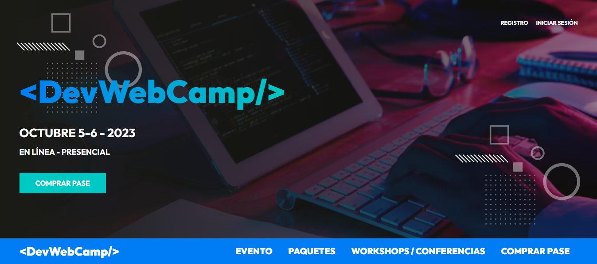

<h1 align="center">Welcome to DevWebCamp project :sparkles:</h1> 

This project has as a principle to communicate to the developers about the workshops and conferences that will be given at the event in the two days established for this purpose. For the event will be given to registered developers the opportunity to purchase different plans, being these the free pass with basic gifts, the onsite pass which is the most complete and the virtual pass with more benefits than the free one but less than the onsite one. The project has a public area for those who will attend the event and an administration area to manage the page and all the movements made on it.
 
The project was built with the MVC structure, mostly with PHP language, JavaScript was also used for small functionalities and also to build an API to query the database through Fetch API. The MySQL database consists of different tables to store data such as: the registration of those who will attend the conferences (mail, personal information), the workshops and conferences, the method of payment.

## Home Page :house:

To begin with, participants will be able to see the home page, which presents a summary of the important information of the event, i.e. the date of the event, the name of all the workshops and conferences, the speakers for each of these as well as the time of each event, a map to see the location of the event (made with <a href="https://leafletjs.com/" target="_blank">Leaflet</a>) and the tickets with their respective prices, as well as a button that will take them to a tab that will show them what each ticket contains. The home page uses animations for its elements, for these animations I used <a target="_blank" href="https://michalsnik.github.io/aos/">AOS</a> (animate On Scroll Library).

## Evento, Workshop / Conferencias, Comprar pase y paquetes :arrow_upper_right:

In this part I show you the other functionalities of the public area, for example, you have the tab "event", here is given a brief description about the event in general, then we have the tab packages that contains the different methods or plans that are available, followed by the section workshops / conferences, here are shown all the events (the <a href="https://swiperjs.com/" target="_blank">Swiper</a> library is used for the slider), with their description, speakers, times and dates and finally I show you the registration section for those who want to attend must register here or if you already have an account and chose one of the event passes, you can log in to see your ticket.

## A register simulation 	:mag_right:

Here I show you how a person who wants to attend the event would register. First the form, all the fields of this form are properly validated and are required, this information is necessary to generate the personalized ticket, once the correct information is placed, proceed to verify the user's email (for this part I used PHPMailer). After confirming the user's account, the user is sent to the "finish registration" window, here the participant must choose one of the 3 plans. Finally, the user is shown his ticket with his name and the plan he has chosen.
Note: the payment versions must be made through PayPal but currently this function is not available.

## Administration area :closed_lock_with_key:

The first thing the administrator sees is an administration panel as a dashboard where a summary of the most relevant information for him is presented, i.e. the latest registrations, the income of the event by registered people, the events with less places available and those with more places. This area has different tabs such as speakers, here you can register new speakers for the conferences, you can modify the information of each one as well as delete them from the database, for better visualization of the speakers a pager was built.  Then there is the events tab built with the same logic, add new ones, modify the existing ones and display them. In the same way there are the registered users, here they are shown with the most relevant information such as name, email and the plan they chose for the event. Finally there is the section of gifts that is nothing more than a graph with the gifts chosen by the users of the payment plans.

## Author
This project is part of the course "Desarrollo web Completo" whose the instructor is Juan de la Torre, you can see his page <a href="https://codigoconjuan.com/" target="_blank">here</a>:arrow_forward:.

:octocat: **Randy Urriola**
- Portfolio: <a href="https://randy-urriola.github.io/Portfolio/" target="_blank">/randy-urriola</a>
- GitHub: <a href="https://github.com/randy-urriola" target="_blank">@randy-urriola</a>
- LinkedIn: <a href="https://www.linkedin.com/in/randy-urriola/" target="_blank">@randy-urriola</a>

## 💻 Programming Lenguages and Tools used:

<code></code>&nbsp;&nbsp;
<code></code>&nbsp;&nbsp;
<code></code>&nbsp;&nbsp;
<code></code>&nbsp;&nbsp;
<code></code>&nbsp;&nbsp;
<code></code>&nbsp;&nbsp;
<code></code>&nbsp;&nbsp;
<code></code>&nbsp;&nbsp;
